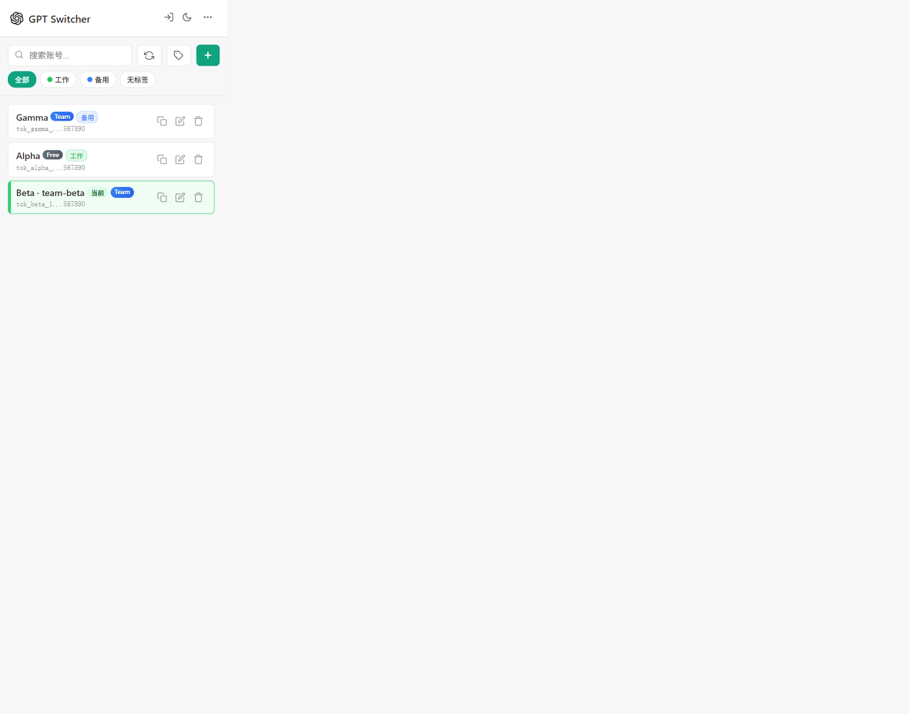
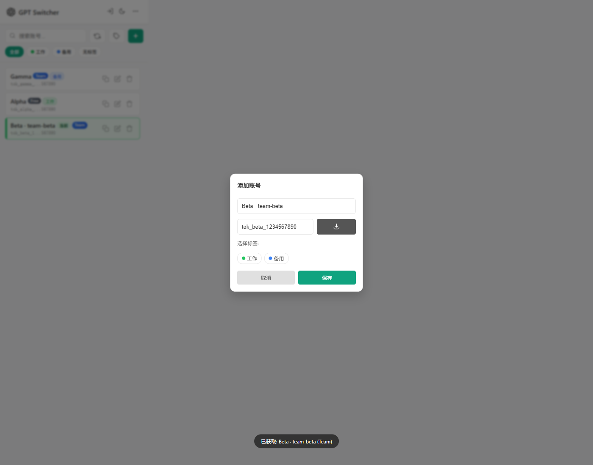
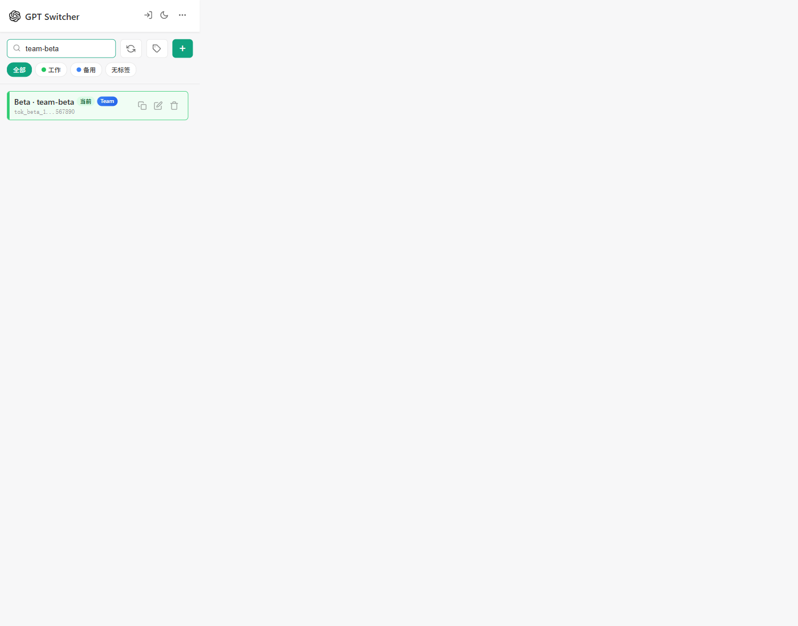
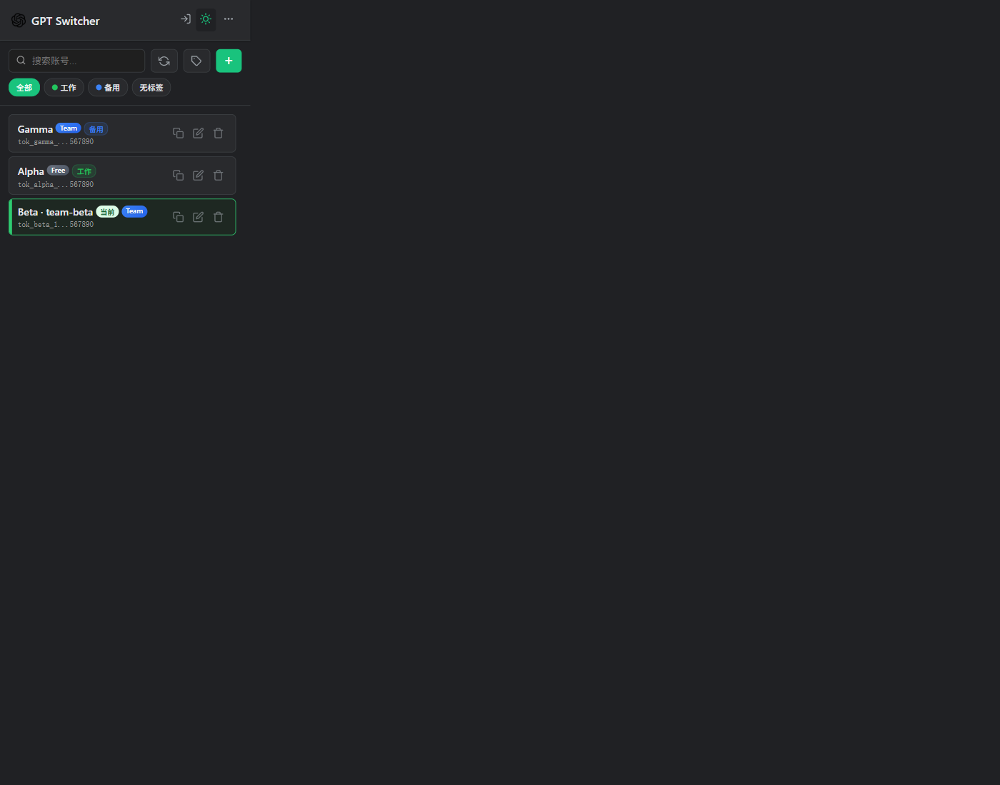
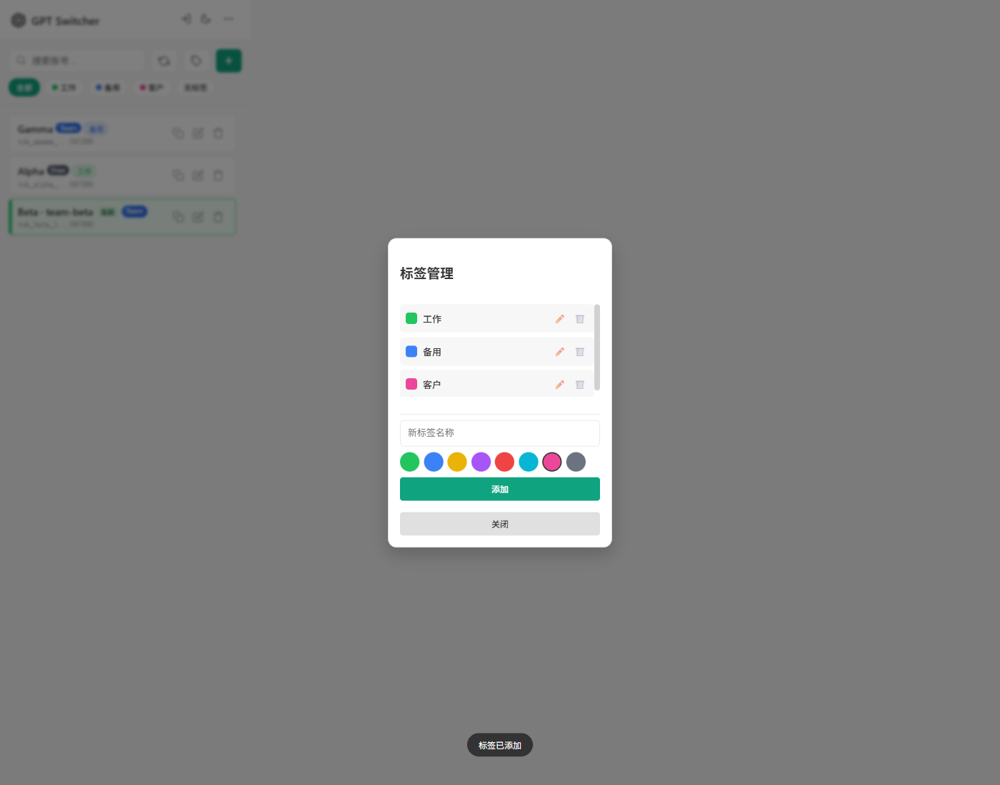
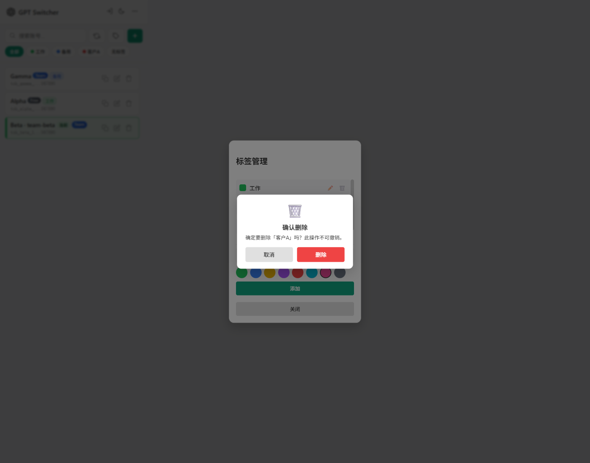
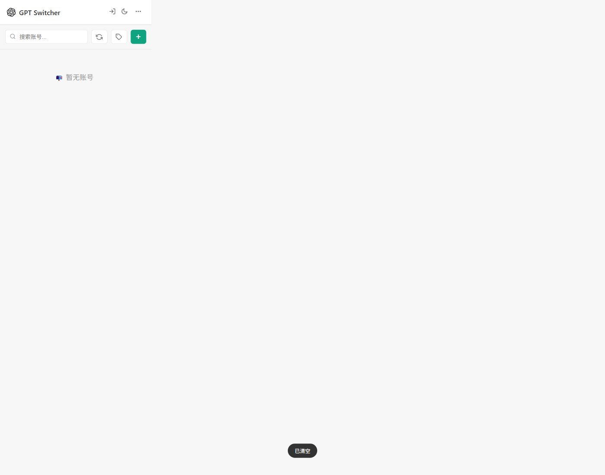

# GPT Session Switcher

一个轻量、高效的 Chrome 扩展，用于在多个 [ChatGPT](https://chatgpt.com) 账号之间无缝切换。基于 **Manifest V3** 和原生 JavaScript 构建，拥有现代化的 UI 设计。

## ✨ 功能特性

* **⚡ 一键切换**: 无需手动退出再登录，点击即可瞬间切换账号。
* **🏢 Team Workspace 支持**:
    * 识别 Team 套餐、用户 ID、账号 ID、组织 ID 和工作区信息。
    * 兼容 Team 场景下的账号名展示、搜索和同步。
* **🏷️ 标签管理系统**: 
    * 创建自定义颜色标签来分类管理账号。
    * **标签筛选栏**: 一键按标签筛选账号。
    * **独立标签排序**: 每个标签视图维护独立的拖拽排序顺序。
    * **"无标签"筛选**: 快速查找没有任何标签的账号。
* **🎨 现代化 UI**: 
    * 采用卡片式设计，支持**深色模式**。
    * **自定义删除确认弹窗**: 精美对话框取代原生浏览器提示。
    * **ESC 快捷键**: 按 ESC 关闭任意弹窗。
* **📥 智能自动获取**: 
    * 自动从当前标签页抓取 `session-token`。
    * 智能提取用户名和套餐信息。
* **🏷️ 套餐徽章**: 在账号卡片上显示可视化套餐标识（Pro/Plus/Team/Free）。
* **🔄 快速同步**: 工具栏一键更新当前账号的用户名和套餐信息。
* **🖱️ 拖拽排序**: 长按并拖动即可调整账号列表顺序。
* **💾 导入与导出**: 支持将账号列表备份为 JSON 文件。
* **🔒 安全本地化**: 所有数据仅存储在浏览器本地，绝不上传至任何远程服务器。

## 🖼️ 功能预览

### 主界面总览

### Team 账号自动抓取

### Team 工作区搜索

### 深色模式

### 标签管理

### 删除确认弹窗

### 清空后的空状态

## 📦 安装指南

1. 下载最新 [Release](https://github.com/kieranchan/GPT-switcher/releases)
2. 解压 ZIP 文件到一个文件夹
3. 打开 Chrome 浏览器，访问 `chrome://extensions/`
4. 打开右上角的 **开发者模式**
5. 点击 **加载已解压的扩展程序**，选择解压后的文件夹
6. 完成！点击工具栏中的扩展图标即可使用

## 📖 使用说明

### 添加账号
1. 确保已登录 ChatGPT
2. 点击扩展图标，点击 **+** 按钮
3. 点击 **📥** 按钮自动抓取账号信息
4. 可选择标签来分类管理账号
5. 点击 **保存**

### 切换账号
点击列表中的任意账号卡片即可切换。如果没有 ChatGPT 页面打开，会自动创建新标签页。

### 标签管理
* 点击工具栏中的 **标签图标** 打开标签管理器。
* 创建、编辑或删除带颜色的标签。
* 使用工具栏下方的 **标签筛选栏** 按标签筛选账号。

## ✅ MCP 浏览器实测

本轮使用 MCP 浏览器对 popup 主要流程做了交互测试，导入/导出功能不包含在这轮截图测试中。

已验证场景：

* 主界面列表渲染、套餐徽章和当前账号高亮
* 添加账号弹窗打开与关闭
* 自动抓取 Team 账号的 token、名称和套餐
* 工作区关键词搜索
* 深色模式切换
* 标签新增、编辑、删除和删除确认弹窗
* 账号编辑和标签更新
* 账号切换后的激活状态与标签页刷新动作
* 当前账号信息同步
* 登出并跳转登录页
* 清空数据后的空状态

## ⚠️ 安全声明

* **仅限本地**: 您的数据永远不会离开您的浏览器
* **权限说明**: 
    * `cookies`: 用于修改 Cookie 实现账号切换
    * `scripting`: 用于从页面 DOM 中读取用户名
    * `storage`: 用于保存账号列表

## 📄 许可证

本项目基于 MIT 许可证开源
